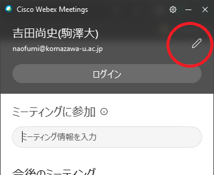
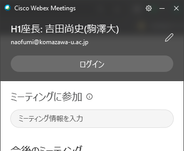

# DEIM2020オンライン会議 座長向け情報

[<<Home](README.md)

1. セッション開始10分前に，ブラウザでDEIM2020参加者用プログラムを開き，Webex Meetingのセッションの会議室に入る．最初に入る際に，名前の入力
を要求されるので，「A1座長:氏名(所属)」などと名前に設定して，参加者に分かるようにする．
（名前を変更するには，ミーティングから退席した状態で，Webex Meetingアプリを立ち上げ，「氏名(名前)」のみの名前に変更しておき，DEIM2020参加者用プログラムから会議に参加する）
1. マイクのミュートを解除し，また，インカメラをオンにし，参加者にアナウンスできる状態にする．発言するときだけ，こまめにマイクのミュートを解除した方がよい．
1. 発表者がA1-1など，発表番号の名前を先頭に付した状態で会議室にログインしてくるので，特定しておく．発表者がいない場合は飛ばして，特定できた後で最後に発表させるなど，臨機応変に対応してもよい．
1. セッション開始時刻に，セッション開始を宣言する．そのとき，次のアナウンスを行う．
    * 静音な環境を維持するため参加者は各自のマイクをミュートにすること
    * 通信帯域を節約するため，インカメラをオフすること
    * 事務局が強制的にマイクミュートやインカメラをオフにする場合があること
    * 質問などの連絡は，「チャット」を使って質問すること．
    * その他表彰などのアナウンス
1. 発表者には，マイクのミュートを解除すること，インカメラをオンにすること，「コンテンツの共有」からプレセンを開始してもらうこと，を伝え，発表を開始してもらう．「よく聞こえます」「スライドが見えました」などの音声によるフィードバックを発表者にしてあげるとスムーズに進む．
1. タイムキーパーは座長が行う．学会タイマーなどを用いる．
    * http://maruta.github.io/timekeeper/
    * 合計 20分→切り替え時間を考慮し18分（発表：12～15分，質疑：3～5分）（1鈴：12分，2鈴：15分，3鈴：18分）
1. 一人の発表が終わるたびに，参加者からのチャットによる質問から，質問をピックアップし，あるいは，自らの質問を混ぜ，座長と発表者による質疑応答を行う．
（十分時間がある場合には，参加者に呼びかけ，マイクのミュートを解除にして直接質問してもらう）
1. 一人の持ち時間が過ぎたら，コンテンツの共有を停止してもらい，次の発表に移る．
1. すべての発表が終了したら，終了を宣言して，「退席」ボタンによりミーティングから退席する．セッション終了予定時刻の10分後には，セッションを終える．

### 技術報告について

- 協賛企業からの技術報告について
   - プログラム中で、発表タイトルの前に「黄色い印と【技術報告】」がついている発表は、協賛企業からの技術報告です。
   - 発表開始時に、協賛企業からの技術報告(企業での技術的な取組みの紹介)であることを一言説明してください。
   - 発表終了後は、一般発表と同様に質疑応答の時間として、積極的な質疑をお願いします。
   - 予稿原稿はありません。
   - 1件20分でお願いいたします．
   - 技術報告があるセッションと当該セッションの座長の先生方は以下の通りです。
      - B2 ファッション (藤原靖宏)
      - C2 情報検索① (角谷和俊)
      - A4 機械学習・深層学習④ (丸橋弘治)
      - B4 情報推薦② (田中克己)
      - C4 ソーシャルビッグデータ② (森嶋厚行)
      - A5 情報検索③ (灘本明代)
      - B5 情報推薦③ (加藤誠)
      - C5 ソーシャルビッグデータ③ (義久智樹)
      - A6 QUALITY OF LIFE (小杉尚子)
      - B6 情報推薦④ (小林亜樹)
      - C6 マルチメディア② (山肩洋子)

### 注意事項

- 各セッションに，学生アルバイトによるセッション管理者（従来の会場係に相当）が張り付いているので，マイクの一斉ミュート等，必要に応じて依頼してください．
- それでも解決できないトラブルの場合は，当日共有される電話番号（緊急連絡先）へ連絡をお願いします．
- 現在のところコメンテータの割り当てはしておりませんので，質疑応答は座長と発表者の間でお願いします．

（名前の変更の例）

