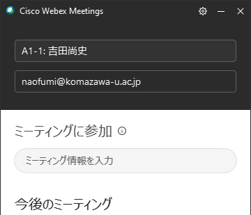

# DEIM2020オンライン会議 座長向け情報

[<<Home](README.md)

1. セッション開始10分前に，ブラウザでDEIM2020参加者用プログラムを開き，Webex Meetingのセッションの会議室に入る．最初に入る際に，名前の入力
を要求されるので，「A1座長:氏名」などと名前に設定して，参加者に分かるようにする．
（名前を変更するには，ミーティングから退席した状態で，Webex Meetingアプリを立ち上げ，「氏名」のみの名前に変更しておき，DEIM2020参加者用プログラムから会議に参加する）
1. マイクのミュートを解除し，また，インカメラをオンにし，参加者にアナウンスできる状態にする．
1. 発表者がA1-1など，発表番号の名前を先頭に付した状態で会議室にログインしてくるので，特定しておく．発表者がいない場合は飛ばして，特定できた後で最後に発表させるなど，臨機応変に対応してもよい．
1. セッション開始時刻に，セッション開始を宣言する．そのとき，次のアナウンスを行う．
    * 静音な環境を維持するため参加者は各自のマイクをミュートにすること
    * 通信帯域を節約するため，インカメラをオフすること
    * 事務局が強制的にマイクミュートやインカメラをオフにする場合があること
    * 質問などの連絡は，「チャット」を使って質問すること．
    * その他表彰などのアナウンス
1. 発表者には，マイクのミュートを解除すること，インカメラをオンにすること，「コンテンツの共有」からプレセンを開始してもらうこと，を伝え，発表を開始してもらう．
1. 一人の発表が終わるたびに，参加者からのチャットによる質問から，質問をピックアップし，あるいは，自らの質問を混ぜ，座長と発表者による質疑応答を行う．
（十分時間がある場合には，参加者に呼びかけ，マイクのミュートを解除にして直接質問してもらう）
1. 一人の持ち時間が過ぎたら，コンテンツの共有を停止してもらい，次の発表に移る．
1. すべての発表が終了したら，終了を宣言して，「退席」ボタンによりミーティングから退席する．セッション終了予定時刻の10分後には，セッションを終える．

（名前の変更の例）

