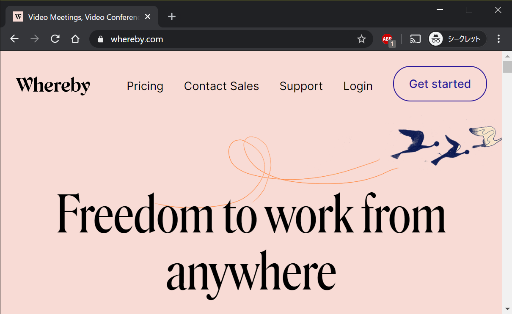
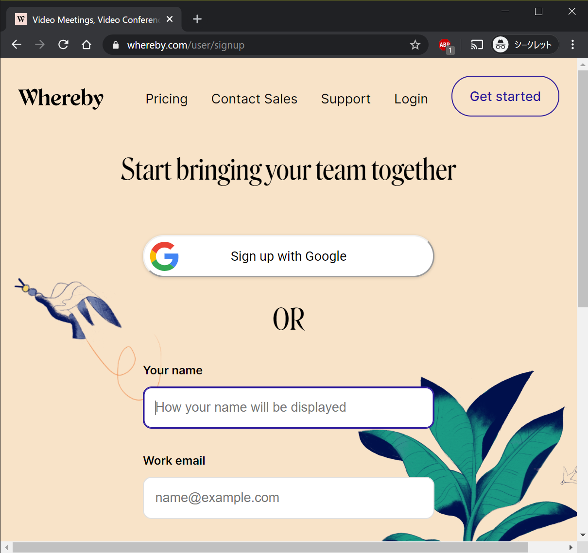
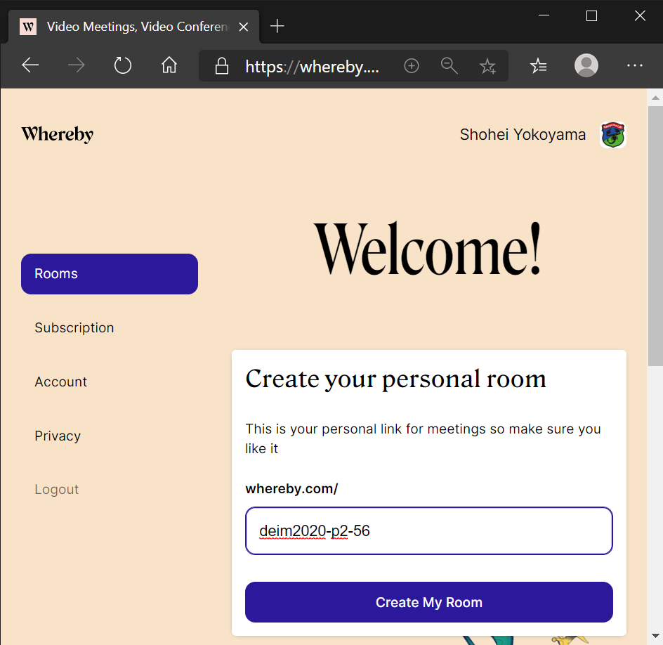
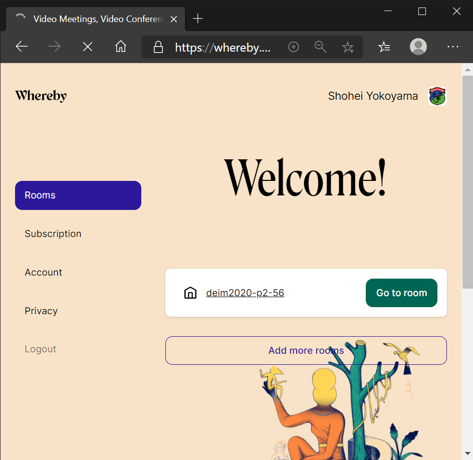
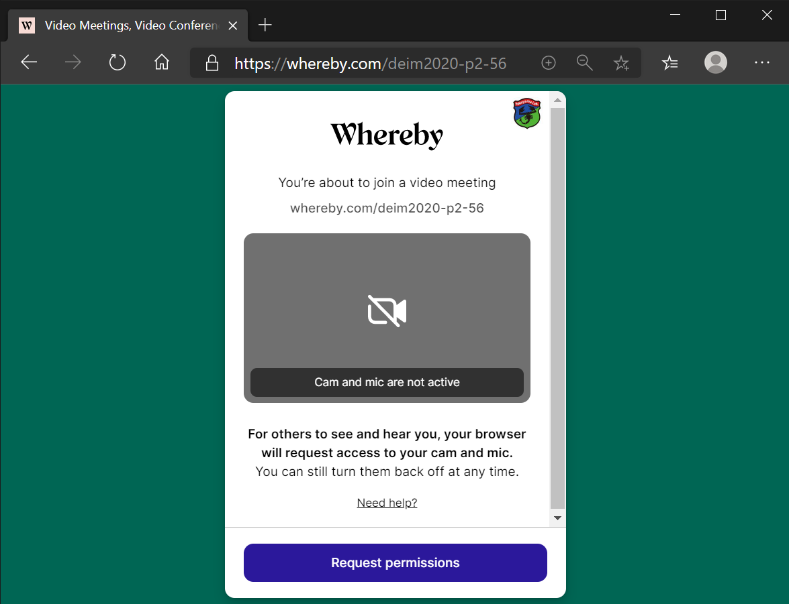
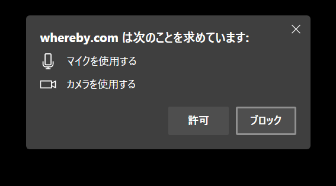
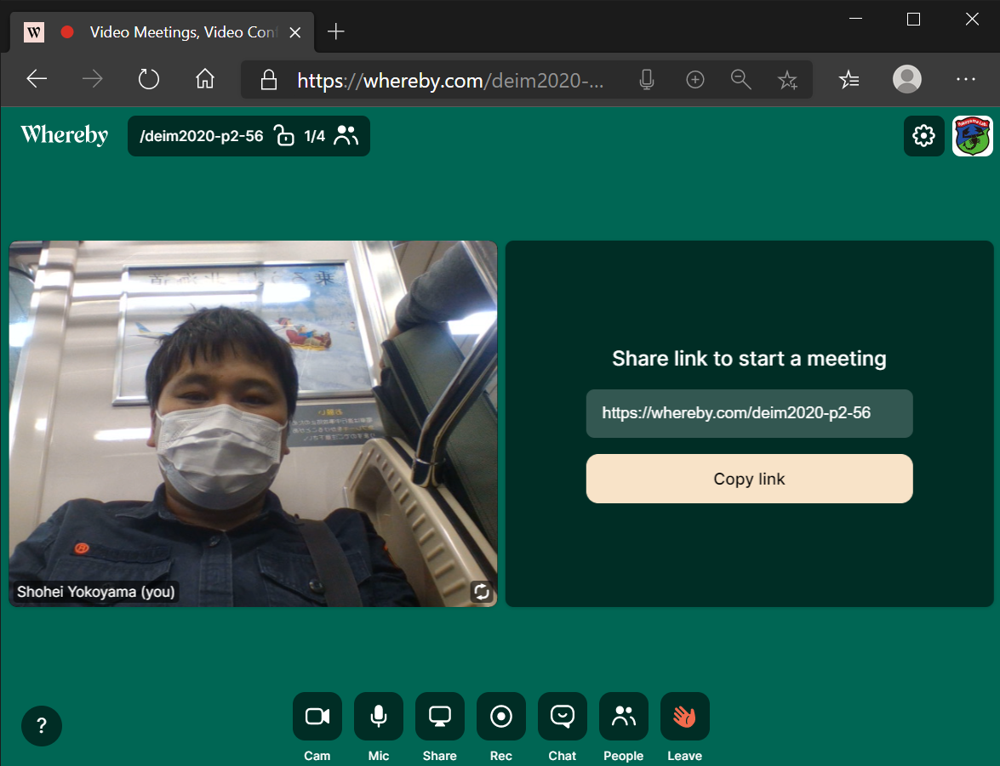

# DEIM2020オンライン会議　ポスター発表の手引き

[<<Home](README.md)

## オンライン会議システムの準備

* [ステップ1] ***Whereby***へ行き***Sign upをクリック***
    * https://whereby.com/
    

* [ステップ2] ***Google***もしくは***メールアドレス***でサインアップ

* [ステップ3] ***Personal Room***を作る
    * 部屋名は重複は許されていないので、少し複雑にする必要があります。例：deim2020-p2-56

* [ステップ4] インタラクティブセッション用の***オンライン会議***が生成される

* [ステップ5] ***Go to room***をクリックして会議室に入る
    * 初回利用時はカメラがONになっていないので***Request Permissions***をクリックしよう！
 

* [ステップ6] ブラウザにWherebyで***カメラとマイクの使用を許可する***

* [ステップ7] 無事、カメラに***自分の顔が映る***
    * 試しに***Join meeting***をクリックしてオンライン会議に入ってみましょう。

* [ステップ8] ***オンライン会議画面***
    * 画面右側にこのオンライン会議のURLが表示されます。このURLをポスターPDFと共に提出してください。
    * URLは一度生成してしまえば、ブラウザを閉じた後も有効です。コアタイム時刻になったら、このURLを開き***Join Meetign***してください。
    * なお、カメラはオフにもできますので、ご安心ください。
    

> これはあくまで実験的な試みですので、あまり気負わず、出来る範囲でご対応ください。
