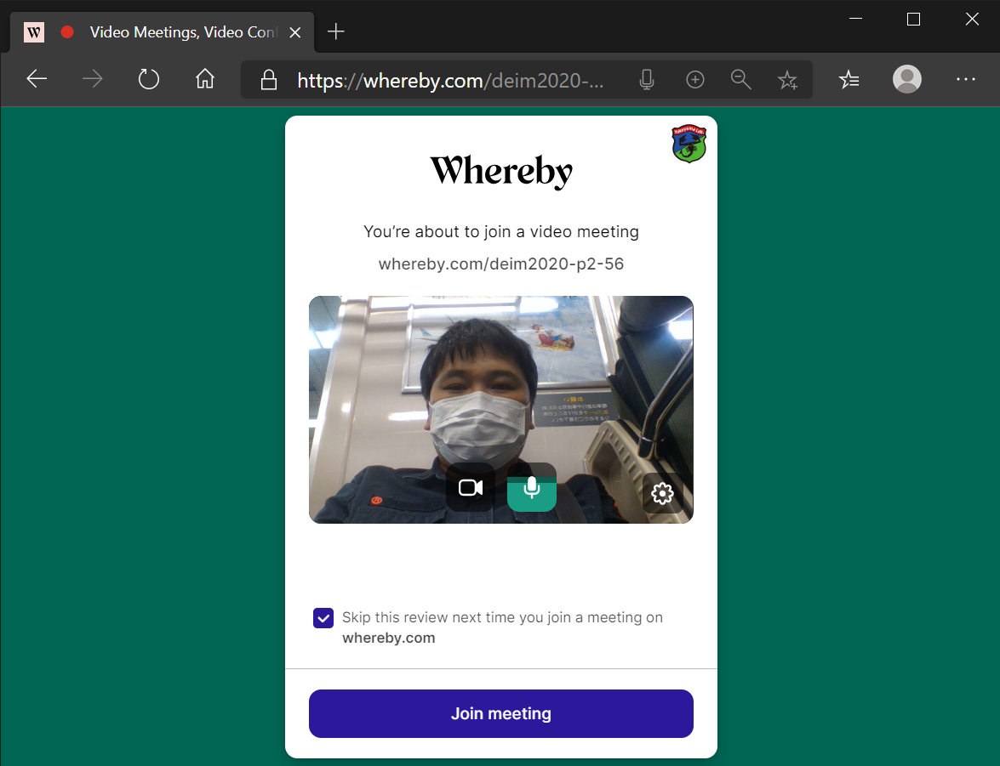

# DEIM2020オンライン会議　ポスター発表の手引き / DEIM2020 Online Conference Procedures for Poster Presentations

[<<Home](README.md)

## オンライン会議システムの準備

* [ステップ1] ***Whereby***へ行き***Sign upをクリック***  / [Step 1] Go to ***Whereby***  and click ***Sign up***
    * https://whereby.com/
    

* [ステップ2] ***Google***もしくは***メールアドレス***でサインアップ  / [Step 2] Sign up using ***Google*** or an *** e-mail address ***

* [ステップ3] ***Personal Room***を作る  / [Step 3] Create a ***Personal Room***
    * 部屋名は重複は許されていないので、少し複雑にする必要があります。例：deim2020-p2-56
    * Duplicate room names are not permitted, so use a somewhat complex name. E.g.: deim2020-p2-56.

* [ステップ4] インタラクティブセッション用の***オンライン会議***が生成される  / [Step 4] An ***Online Meeting *** for an interactive session will be generated.

* [ステップ5] ***Go to room***をクリックして会議室に入る  / [Step 5] Click ***Go to room*** to enter the meeting
    * 初回利用時はカメラがONになっていないので***Request Permissions***をクリックしよう！
    * When you first use it, your camera will be OFF, so click ***Request Permissions***.
 

* [ステップ6] ブラウザにWherebyで***カメラとマイクの使用を許可する***  /  [Step 6] In the browser, *** Allow use of camera and microphone *** for Whereby.

* [ステップ7] 無事、カメラに***自分の顔が映る***  / [Step 7] If all goes properly, *** Your face will be captured *** by the camera.
    * 試しに***Join meeting***をクリックしてオンライン会議に入ってみましょう。
    * As a test, click ***Join meeting*** to check that you can join the online meeting.

* [ステップ8] ***オンライン会議画面***  / [Step 8] ***Online meeting screen ***
    * 画面右側にこのオンライン会議のURLが表示されます。このURLをポスターPDFと共に提出してください。
    * URLは一度生成してしまえば、ブラウザを閉じた後も有効です。コアタイム時刻になったら、このURLを開き***Join Meetign***してください。
    * なお、カメラはオフにもできますので、ご安心ください。
    * The online meeting URL is displayed on the right side of your screen. Submit this URL with your poster PDF. 
    * Once the URL has been generated, it will be valid even after closing the browser. When core time begins, open this URL to *** Join Meeting ***.
    * Note that the camera can be turned off if necessary.

    

> これはあくまで実験的な試みですので、あまり気負わず、出来る範囲でご対応ください。

> This is just an experimental trial, so do not be too concerned, and just do your best.
