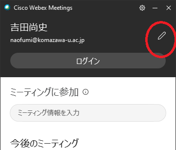
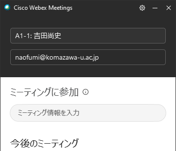
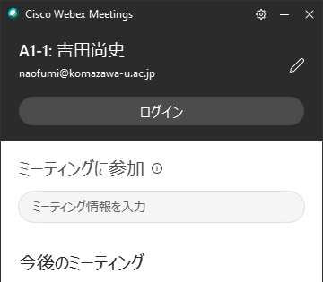
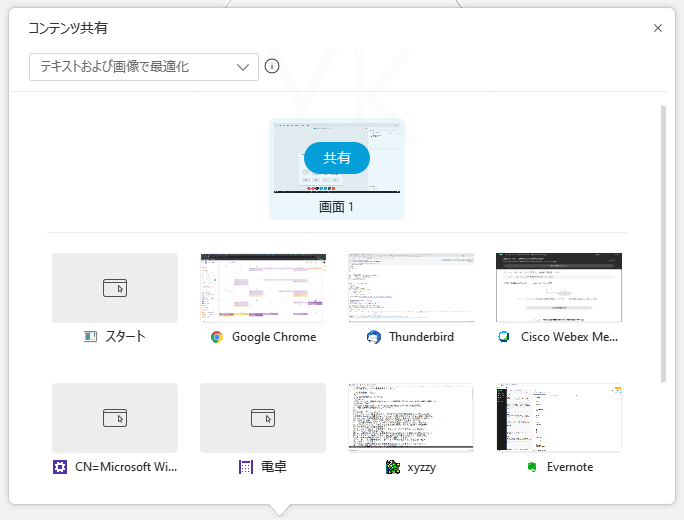
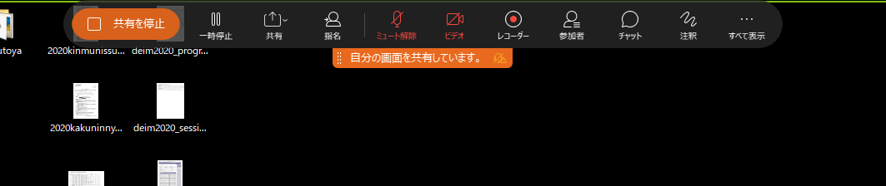

# DEIM2020オンライン会議　発表者向け情報

[<<Home](README.md)

## 日本語

1. セッション開始10分前に，ブラウザでDEIM2020参加者用プログラムを開き，Webex Meetingのセッションの会議室に入る．最初に入る際に，名前の入力を要求されるので，「A1-1:氏名」のように，発表番号を名前に付けて，参加者に分かるようにする．
（名前を変更するには，ミーティングから退席した状態で，Webex Meetingアプリを立ち上げ，「氏名」のみの名前に変更しておき，DEIM2020参加者用プログラムから会議に参加する）
1. PowerPoint等のプレゼンテーションアプリを用いて，自分のプレゼンテーション資料を立ち上げておく．
1. 発表の順番になったら，Webex Meetingから，以下の３操作によりプレゼンテーションを開始する．
    * マイクのミュートを解除
    * インカメラをオン
    * 「コンテンツの共有」ボタンから，プレゼンテーション資料，あるいは，画面全体を選ぶ
4. 発表が終了したら，そのまま，音声で座長と質疑応答を行う．
5. 質疑応答が終わったら，画面上部のメニューのコンテンツの共有の停止，を選びプレゼンテーション資料の配信を停止する(スクリーンショット)
6. 終わったら，通常の参加者としてセッションに参加する

（名前の変更の例 / Example of Changing Screen Name）

（プレゼンテーション開始の例 / Example of Starting Presentation）

（プレゼンテーション終了の例 / Example of Ending Presentation）

## English

1. 10 min. before the starting time of the session, from DEIM2020 program, you need to enter the conference room. When you enter it, you must name yourself as "A1-1: Firstname Familyname" to identify for participants.
(To change your name, after leaving the confernece, you can change your name from Webex Meeting App. Your name will be changed next time)
1. Launch your presentation materials such as PowerPoint.
1. When you start the presentation:
    * unmute your microphone
    * turn on your in-camera
    * select your presentation or whole screen from "share the contents"
1. After finishing your presentation, you need to answer questions from the session chair or participants.
1. After finishing Q&A, you will stop your presentation from the menu, above the screen, stop sharing the contents 
6. You can join the session as a participant.
